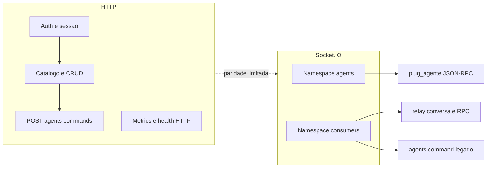

# Documentacao do `plug_server`

## Como navegar

Use os documentos nesta ordem:

1. `docs/PROJECT_OVERVIEW.md` para entender papeis, canais e limites do hub.
2. `docs/api/client_agent_business_rules.md` para ownership, aprovacao, autorizacao e revogacao.
3. `docs/api/api_rest_bridge.md` para o contrato HTTP e o bridge legado `agents:*`.
4. `docs/socket/socket_relay_protocol.md` para o contrato relay `relay:*` em `/consumers`.
5. `docs/configuration.md` e `src/shared/config/env.ts` para defaults, parsing e variaveis.

Para rotas HTTP, a referencia viva e o OpenAPI exposto em `GET /docs` e `GET /docs.json`.
Os caminhos canonicos usam prefixo `/api/v1`, com excecao dos aliases de compatibilidade
`/auth/*`. O endpoint `GET /metrics` (Prometheus) esta em `/metrics` na raiz e tambem
em `/api/v1/metrics` para alinhamento com o OpenAPI; em ambos os casos exige JWT com
`role=admin`.

## Inicio rapido

- `docs/PROJECT_OVERVIEW.md`: mapa do produto, dos namespaces Socket e dos canais REST.
- `docs/api/client_agent_business_rules.md`: regra oficial do modelo `User` / `Agent` / `Client`.
- `docs/api/api_rest_bridge.md`: `POST /api/v1/agents/commands`, respostas normalizadas, `Retry-After` e offline bridge.
- `docs/socket/socket_relay_protocol.md`: contrato relay em `/consumers`.
- `docs/socket/socket_client_sdk.md`: guia pratico para consumidor Socket.
- `docs/configuration.md`: checklist de ambiente, defaults e links para `env.ts` / `.env.example`.
- `CHANGELOG.md`: historico de mudancas que afetam contrato e operacao.

## Superficie HTTP vs Socket

A maior parte da API do produto expoe-se por **HTTP** (`/api/v1/...`, OpenAPI em `GET /docs`). O **Socket** cobre transporte em tempo real entre hub, **consumers** (`/consumers`) e **agentes** (`/agents`), nao substitui o REST inteiro.

- Visao de produto e canais: [PROJECT_OVERVIEW.md](PROJECT_OVERVIEW.md).
- Bridge REST e canal legado `agents:*`: [api_rest_bridge.md](api/api_rest_bridge.md).
- Relay `relay:*`: [socket_relay_protocol.md](socket/socket_relay_protocol.md).

## Por assunto

### Produto e regras

- `docs/PROJECT_OVERVIEW.md`
- `docs/api/client_agent_business_rules.md`
- `docs/api/user_status.md`

### Transporte e integracao

- `docs/api/api_rest_bridge.md`
- `docs/socket/socket_relay_protocol.md`
- `docs/socket/socket_client_sdk.md`
- `docs/plug_agente/migracao_plug_agente_namespaces.md`
- `docs/plug_agente/communication_sync_plug_agente.md`

### Operacao

- `docs/configuration.md`
- `docs/limits/` — limites de acesso, quotas e respostas quando atingidos ([`limites_acesso_e_quotas.md`](limits/limites_acesso_e_quotas.md))
- `docs/infrastructure/nginx_production.md`
- `docs/performance/performance_hub_agent.md`
- `docs/observability/observability.md`
- `docs/performance/load_testing.md`
- `docs/performance/e2e_benchmark_hub_agent.md`

### Redis (modulos compartilhados)

- `src/infrastructure/redis/README.md` — mapa dos 5 modulos + 2 factories.
- `docs/infrastructure/redis_security.md` — checklist de auth/TLS/ACL/eviction.
- `docs/infrastructure/redis_streams_agent_backlog.md` — entrega at-least-once `client:custom.*` (inclui batch fan-out P1).
- `docs/grafana/redis_dashboard.json` — dashboard Prometheus pronto.
- `docs/observability/alerts/redis.yml` — regras de alerta.
- `docs/observability/alerts/rate_limits.yml` — rejeicoes sustentadas de rate limit HTTP/Socket (429).
- `docs/runbooks/redis_cluster_migration.md` — runbook standalone -> Cluster.
- `docs/spikes/_README.md` — index de spikes (NO-GO docs).
- ADRs: `docs/adrs/0001-fail-open-default.md`, `0002-hash-tag-prefix.md`, `0003-streams-vs-pubsub.md`, `0004-circuit-breaker-thresholds.md`, `0005-instrumented-redis-client-factory.md`, `0006-redis-multi-tenancy.md`, `0007-parallel-redis-init.md`.

### Roadmap e estudos

- `docs/studies/scaling_and_roadmap.md`
- `docs/studies/relay_fastpath_study.md`
- `docs/studies/db_partitioning_study.md`

### plug_agente (coordenacao cross-repo)

- `docs/plug_agente/README.md` — status de entrega e roadmap proativo.
- `docs/plug_agente/communication_sync_plug_agente.md` — checklist de sincronizacao.
- `docs/plug_agente/migracao_plug_agente_namespaces.md` — migracao `/agents` vs `/`.
- `docs/plug_agente/01_relay_body_id_echo.md` — relay body.id echo.
- `docs/plug_agente/04_agent_implementation_status.md` — estado de implementacao.

### Runbooks

- `docs/runbooks/redis_cluster_migration.md`
- `docs/runbooks/socket_perf_investigation.md`
- `docs/runbooks/payload_signing_key_rotation_runbook.md`

## Papel de cada documento

- `docs/PROJECT_OVERVIEW.md`: visao executiva e mapa conceitual.
- `docs/api/client_agent_business_rules.md`: fonte canonica das regras de negocio.
- `docs/api/api_rest_bridge.md`: contrato REST e `agents:command`.
- `docs/socket/socket_relay_protocol.md`: contrato relay e PayloadFrame no consumidor.
- `docs/socket/socket_client_sdk.md`: guia de implementacao, sem repetir o contrato completo.
- `docs/configuration.md`: fonte narrativa de configuracao; defaults formais vivem em `env.ts`.
- `docs/limits/limites_acesso_e_quotas.md`: limites HTTP/Socket/Nginx, login e respostas ao atingir quotas.
- `docs/observability/observability.md`, `docs/performance/performance_hub_agent.md`, `docs/infrastructure/nginx_production.md`: operacao.
- `docs/studies/scaling_and_roadmap.md`, `docs/studies/relay_fastpath_study.md`, `docs/studies/db_partitioning_study.md`: material nao normativo.
