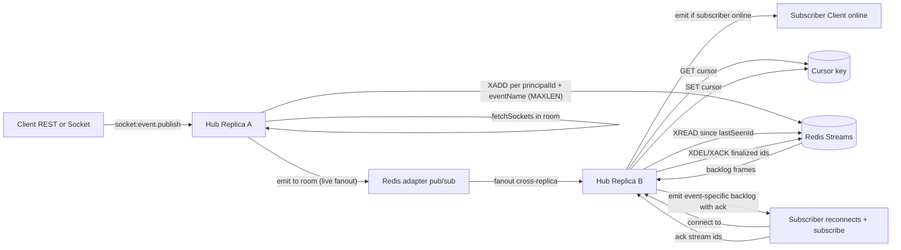

# Per-recipient-and-event Redis Streams backlog (at-least-once)

The hub uses the Socket.IO Redis adapter (`@socket.io/redis-adapter`) to fan
out `client:custom.*` frames to subscribed consumer Clients across replicas.
Pub/sub delivery is _fire-and-forget_: if the target subscriber is briefly
disconnected when the frame is published (between the publish and the
reconnect on another replica), the frame is lost.

This module is an opt-in durable backlog buffer per recipient principal id and
logical event name. This isolation prevents one subscription from advancing or
acknowledging frames that belong to another subscription.
Default disabled.

> **Note on naming.** The module API uses the parameter name `agentId` for
> historical reasons (the Sprint 4 design originally targeted /agents
> sockets). In the current wiring it is the consumer Client `JWT sub` — i.e.
> the _recipient principal id_ for `client:custom.*` events. Treat the two
> terms as synonymous in the codebase.

## Components

- `src/infrastructure/redis/event_stream/agent_event_stream.ts` — XADD / XREAD /
  XDEL/XACK public
  API plus init/close lifecycle. Exposes both the per-frame
  `appendAgentEventFrame(principalId, frame)` (single-recipient) and the
  pipelined `appendAgentEventFramesBatch(entries)` (multi-recipient,
  `MULTI/EXEC` — see "Batch fan-out" below).
- `src/infrastructure/redis/event_stream/agent_event_stream_cursor.ts` — get / commit /
  purge for the `lastSeenStreamId` per `(principalId, eventName)`.
- `src/presentation/socket/hub/agent_event_stream_drain.ts` — orchestrates the
  drain on subscribe (read backlog → emit with ack → commit cursor → XDEL/XACK).
- `src/application/services/agent_event_stream_metrics.service.ts` — counters,
  gauges, and per-op latency histogram (including batch size histogram).
- `AGENT_EVENT_STREAM_*` envs (see `.env.example`).

## Batch fan-out (Sprint P1)

Multi-recipient publishes use `appendAgentEventFramesBatch` to issue all
`XADD` (and optional `PEXPIRE`) commands in a single `MULTI/EXEC`
transaction. Round-trip cost becomes O(1) instead of O(N) recipients,
which is critical for hot publish paths fanning out to dozens of
recipients.

```ts
import { appendAgentEventFramesBatch } from "./agent_event_stream";

const results = await appendAgentEventFramesBatch([
  { principalId: "user-a", frame },
  { principalId: "user-b", frame },
  { principalId: "user-c", frame },
]);
// results: ["1700000000000-0", "1700000000000-1", "1700000000000-2"]
```

Result alignment: the returned array is 1:1 with the input array. A slot
contains the `XADD` reply (stream id) when the entry was accepted and
appended successfully; `undefined` when the entry was filtered (allowlist
mismatch, client not connected, stream disabled) or its individual `XADD`
reply inside the transaction was rejected.

Failure semantics:

- **Global `EXEC` rejection** (network drop, server-side error before
  the transaction committed): every accepted entry returns `undefined`,
  `noteAgentEventStreamCommandError()` increments **once** (not per
  recipient), and a single `agent_event_stream_append_batch_failed`
  warning log is emitted. Live emit already happened, so the publisher
  caller is never blocked on this.
- **Per-entry rejection inside a successful `EXEC`**: counted via
  `noteAgentEventStreamBatchPartialFailure(failedCount)` and surfaced as
  `plug_agent_event_stream_batch_partial_failures_total`.

The single-recipient `appendAgentEventFrame` is preserved as a back-compat
wrapper that simply delegates to the batch API with one entry.

## Data layout

Per-recipient-and-event stream key (Redis Cluster hash-tagged):

```
plug_agent_stream_v2:{plug}:<sanitized-principal-id>:<sha256(eventName)[0..31]>
```

Each entry has fields:

- `eventId` — opaque, matches publish-side `eventId`
- `eventName` — e.g. `client:custom.alerts.fired`
- `emittedAt` — ISO-8601 timestamp
- `payload` — already-encoded payload (PayloadFrame or raw JSON)

Streams are bounded via `XADD MAXLEN ~ N` (`AGENT_EVENT_STREAM_MAX_LEN`,
default `1000`). Idle streams expire via `PEXPIRE` after each append
(`AGENT_EVENT_STREAM_TTL_MS`, default 24 h).

### Key-layout upgrade

The `v2` key prefix intentionally does not share a cursor with the former
per-principal layout: a shared cursor cannot be made safe after events have
already been interleaved. Existing `plug_agent_stream:{plug}:...` keys remain
bounded by their prior TTL and should be allowed to expire; new publishes use
only the isolated v2 layout. Plan the rollout within the configured stream TTL
if a pre-upgrade durable backlog must be manually reconciled.

## Architecture



## Wiring (live)

The module is wired end-to-end. Default off (`AGENT_EVENT_STREAM_ENABLED=false`)
keeps current behaviour. Operators flip the env to enable durable delivery.

1. **Append on publish** — in [src/socket.ts](../../src/socket.ts) the
   `client:custom.*` sink resolves the local recipient principal ids via
   `consumersNsp.in(room).fetchSockets()` (only when the env is on), returns
   them in `PublishConsumerSocketEventResult.recipientPrincipalIds`, and
   [src/application/services/client_socket_event_publish.service.ts](../../src/application/services/client_socket_event_publish.service.ts)
   appends a JSON-encoded frame to each principal-and-event stream after the live
   emit. Append failures degrade silently; the live emit already happened.

2. **Read on subscribe** — in
   [src/presentation/socket/consumers/custom_socket_event_subscription.handler.ts](../../src/presentation/socket/consumers/custom_socket_event_subscription.handler.ts)
   after a successful subscribe, the drain orchestrator
   ([src/presentation/socket/hub/agent_event_stream_drain.ts](../../src/presentation/socket/hub/agent_event_stream_drain.ts))
   reads the backlog and cursor for the just-subscribed event name, then emits
   frames with a Socket.IO ack callback gated by
   `AGENT_EVENT_STREAM_DRAIN_ACK_TIMEOUT_MS`.

3. **Ack after delivery** — once the ack arrives, the drain commits the new
   cursor (`agent_event_stream_cursor.ts`) and finalizes the entries via
   `ackAgentEventFrames`: `XDEL` for cursor mode or `XACK` for consumer-group
   mode.

4. **Cursor persistence** —
   `plug_agent_stream_cursor_v2:{plug}:<principalId>:<event-hash>` stores the
   highest acked streamId for that subscription. TTL mirrors
   `AGENT_EVENT_STREAM_TTL_MS` so abandoned keys are GC'd with their streams.

5. **Consumer-group recovery** — with
   `AGENT_EVENT_STREAM_USE_CONSUMER_GROUPS=true`, the drain first resumes its
   local PEL, claims entries left by a stale replica with `XAUTOCLAIM` after
   `AGENT_EVENT_STREAM_CONSUMER_CLAIM_IDLE_MS`, then reads new entries. This
   preserves at-least-once delivery after a process or replica failure.

6. **Allowlist for gradual rollout** — `AGENT_EVENT_STREAM_AGENT_ALLOWLIST`
   (CSV of principal ids) restricts the durable backlog to specific
   recipients. Empty = all recipients participate when the env is on.

## Capacity planning

Per-recipient-event worst-case memory:

```
N active recipient-event subscriptions × MAX_LEN entries × frame_avg_bytes
```

Defaults:

- `MAX_LEN = 1000`
- `frame_avg_bytes ≈ 1 KB` (PayloadFrame envelope + JSON payload)
- 10 000 active recipient-event subscriptions → `10_000 × 1_000 × 1_024 ≈ 10 GB`

In practice, idle streams expire after 24 h via `PEXPIRE`, so steady-state
memory tracks active agents instead of total agents. Configure
`maxmemory-policy=noeviction` for the streams DB so backlog frames are never
silently dropped — sizing must be enforced via `MAX_LEN`, not eviction.

## Operational guidance

- **Run streams on a separate logical DB** (`AGENT_EVENT_STREAM_REDIS_URL`)
  from rate-limits/idempotency. A bursty stream must never crowd out
  rate-limit state.
- **Monitor `plug_agent_event_stream_dropped_total`**: any non-zero rate
  means malformed entries (bug) or schema drift.
- **Alert on `plug_agent_event_stream_fallback_events_total` > 0** for more
  than a few minutes in a row.
- **Cap `MAX_LEN` and `BACKLOG_MAX_ENTRIES` separately**: `MAX_LEN` bounds
  storage; `BACKLOG_MAX_ENTRIES` bounds the bytes returned by a single
  `XREAD` (avoids large reconnect payloads).
- **Consumer groups need a stable `HUB_INSTANCE_ID`**: a pending frame is first
  resumed by the same replica and is claimed by another only after the
  configured idle period. Clients must still deduplicate by `eventId` because
  recovery is intentionally at-least-once.

## Trade-offs vs Pub/Sub-only (current default)

| Aspect                 | Pub/Sub only (default) | Streams enabled                                        |
| ---------------------- | ---------------------- | ------------------------------------------------------ |
| Memory cost            | ~0 (no buffer)         | `recipient-event subscriptions × MAX_LEN × frame_size` |
| Latency online         | minimal                | minimal (streams append is async / OOB)                |
| Reconnect delivery     | best-effort            | at-least-once until `MAX_LEN`/TTL                      |
| Operational complexity | low                    | medium (capacity, separate DB, cursor)                 |

Stay with pub/sub-only unless a specific workflow needs durable delivery and
the operator can budget Redis memory.
