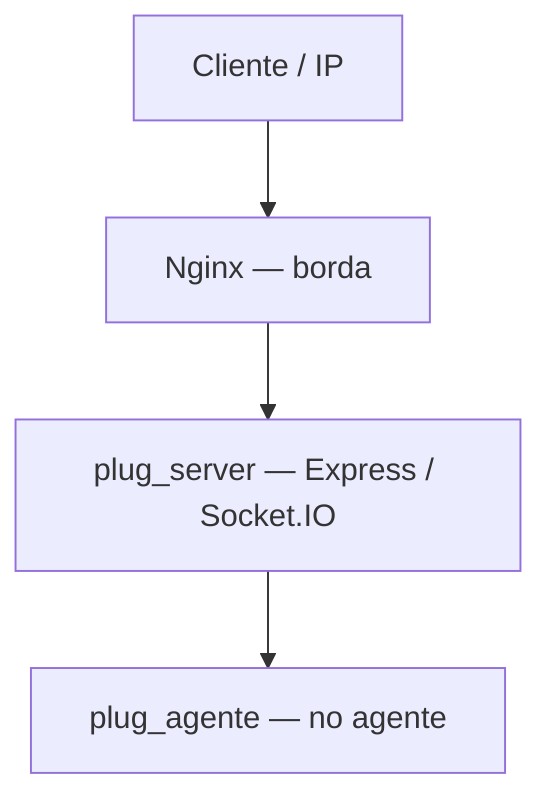
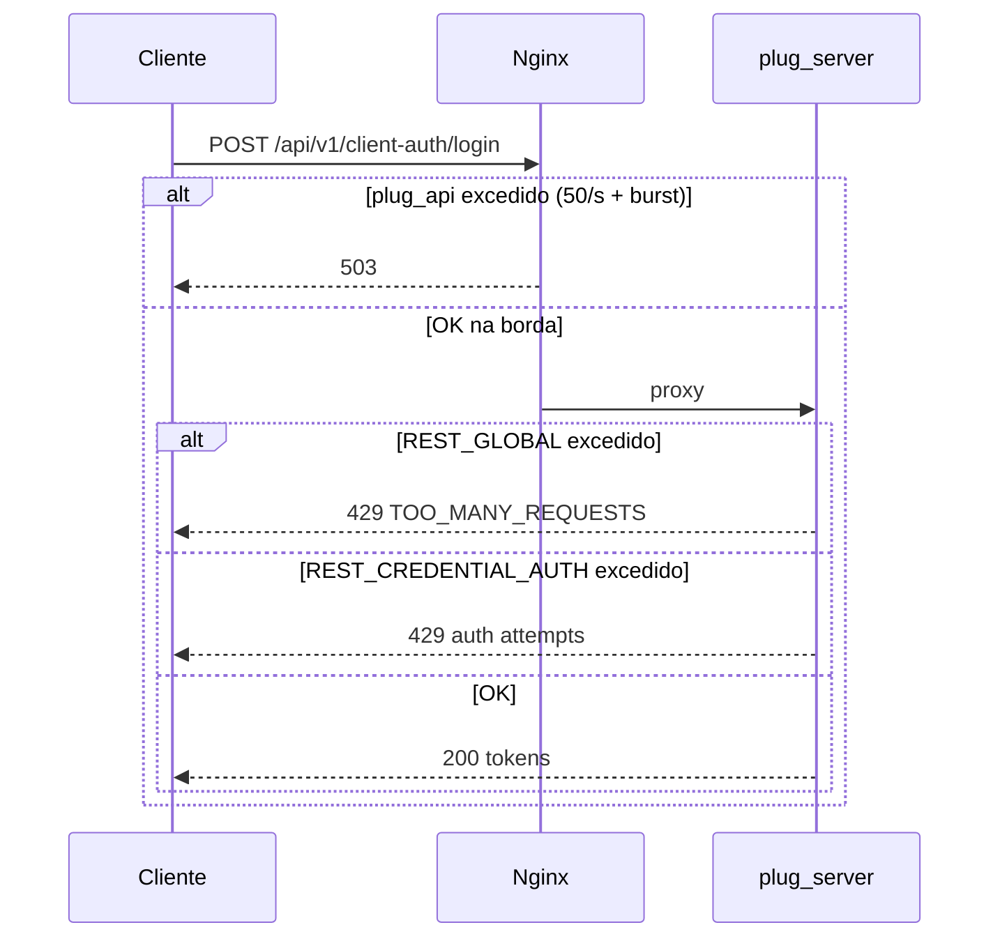

# Limites de acesso e quotas

Este documento descreve os limites que podem **bloquear ou atrasar** pedidos de utilizadores, clientes Colmeia, agentes `plug_agente` e integrações HTTP/Socket. Inclui os **códigos HTTP**, **envelopes JSON** e **eventos Socket** devolvidos quando o limite é atingido.

## Camadas de proteção

O tráfego pode ser limitado em três níveis independentes:



| Camada | Onde configurar | Resposta típica |
| ------ | --------------- | --------------- |
| **Nginx** | `/etc/nginx/conf.d/01-plug-rate-limit.conf`, site `plug-server.*` | **503** (HTML ou corpo mínimo do Nginx) |
| **HTTP (app)** | `REST_*_RATE_LIMIT_*` no `.env` | **429** JSON (`TOO_MANY_REQUESTS`) |
| **Socket (app)** | `SOCKET_*_RATE_LIMIT_*`, filas `SOCKET_*_MAX_*` | Evento com `success: false` ou `agent:register_error` |
| **Agente** | Política no `plug_agente` (ex.: `client_token.getPolicy`) | JSON-RPC **`-32013`** propagado pelo hub |

**Convenção na app:** `REST_*_RATE_LIMIT_MAX=0` (ou equivalente Socket) **desliga** aquele limitador — o middleware deixa de contar pedidos.

**Chave de contagem HTTP:** por **IP** (`req.ip`), com `HTTP_TRUST_PROXY=true` atrás de Nginx para usar o IP real do cliente (`X-Forwarded-For`).

**Multi-réplica:** com `REST_RATE_LIMIT_REDIS_URL` / `SOCKET_RATE_LIMIT_REDIS_URL`, os contadores HTTP/Socket partilham estado via Redis. Sem URL, cada processo Node mantém contadores locais.

---

## Respostas HTTP quando um limite é atingido

### 429 — rate limit da aplicação (Express)

Todos os limitadores REST usam o envelope de erro centralizado:

```json
{
  "success": false,
  "message": "Too many requests, please try again later.",
  "code": "TOO_MANY_REQUESTS",
  "error": {
    "code": "TOO_MANY_REQUESTS",
    "message": "Too many requests, please try again later."
  },
  "requestId": "81877a93-ec20-4dde-9793-0db3d0cddae7"
}
```

A mensagem varia por grupo (ex.: credenciais, refresh, comandos de agente). O campo `code` no `error` mantém-se **`TOO_MANY_REQUESTS`** salvo indicação contrária abaixo.

**Headers úteis** (`express-rate-limit`, `standardHeaders: true`):

| Header | Significado |
| ------ | ----------- |
| `RateLimit-Limit` | Máximo de pedidos na janela |
| `RateLimit-Remaining` | Pedidos restantes na janela actual |
| `RateLimit-Reset` | Timestamp Unix em que a janela reinicia |
| `x-request-id` | ID de correlação (se middleware activo) |

**Acção recomendada ao cliente:** aguardar até `RateLimit-Reset` (ou backoff exponencial com jitter) antes de repetir o pedido.

### 503 — Nginx (`limit_req` / `limit_conn`)

Quando o **Nginx** rejeita na borda, a resposta é **503 Service Temporarily Unavailable**. O corpo costuma ser uma página HTML genérica do Nginx, **não** o JSON da aplicação.

Rotas afectadas e zonas — ver secção [Nginx (borda)](#nginx-borda).

**Acção recomendada:** backoff; verificar se o IP partilha NAT com muitos clientes (login/refresh são os mais sensíveis).

### 503 — filas e sobrecarga na aplicação (não é rate limit clássico)

Alguns caminhos devolvem **503** por **fila cheia** ou **agente offline**, não por contagem de pedidos por IP:

| Situação | Exemplo | Código / mensagem |
| -------- | ------- | ----------------- |
| Fila REST bridge por agente cheia | `POST /api/v1/agents/commands` lento | 503 upstream (Nginx timeout 60s) ou erro de bridge |
| Fan-out Socket excede destinatários | `POST /client/me/socket-events` | `503` com `retry_after_ms` em `error.details` |
| Agente conhecido mas offline | `agents/commands` | Resposta bridge normalizada (não 429) |

Distinction: **429** = quota de taxa; **503** = indisponibilidade temporária ou borda Nginx.

### `Retry-After` em comandos de agente

Em `POST /api/v1/agents/commands`, se o **plug_agente** responder JSON-RPC com código **`-32013`** (rate limit no agente, ex.: `client_token.getPolicy`), o hub pode propagar:

```
Retry-After: <segundos>
```

Derivado de `error.data.retry_after_ms` ou `error.data.reset_at`. Ver [`docs/api_rest_bridge.md`](../api_rest_bridge.md) (secção `client_token.getPolicy`).

---

## Limites HTTP (aplicação)

Valores **por defeito** vêm de `env.ts` / `.env.example`. A coluna **Produção** reflecte o perfil activo no servidor; confirme sempre o `.env` após restart.

**Política:** a **aplicação** é a autoridade (429 JSON + `RateLimit-*`). O **Nginx** complementa com tectos altos (503 HTML só em abuso ou rajada extrema).

### Global — todos os pedidos `/api/v1` e `/auth`

| Variável | Default | Produção | Janela | Efeito |
| -------- | ------- | -------- | ------ | ------ |
| `REST_GLOBAL_RATE_LIMIT_WINDOW_MS` | 900000 (15 min) | **120000 (2 min)** | Deslizante | Conta **cada** pedido sob `/api/v1/*` e `/auth/*` |
| `REST_GLOBAL_RATE_LIMIT_MAX` | 300 | **1000** | — | `0` = ilimitado |

**Inclui:** listagens de agentes, `client-token`, comandos, health (excepto rotas isentas), etc.

**Resposta:** 429, mensagem `"Too many requests, please try again later."`

### Login, registo e credenciais

Limitador dedicado: `credentialAuthRateLimit` (`REST_CREDENTIAL_AUTH_RATE_LIMIT_*`).

| Variável | Default | Produção |
| -------- | ------- | -------- |
| `REST_CREDENTIAL_AUTH_RATE_LIMIT_WINDOW_MS` | 900000 (15 min) | 900000 |
| `REST_CREDENTIAL_AUTH_RATE_LIMIT_MAX` | 25 | **50** |

**Rotas afectadas (além do global):**

| Método | Caminho |
| ------ | ------- |
| POST | `/api/v1/auth/login`, `/auth/login` |
| POST | `/api/v1/auth/register`, `/auth/register` |
| POST | `/api/v1/auth/agent-login` |
| POST | `/api/v1/auth/logout`, `/api/v1/client-auth/logout` |
| POST | `/api/v1/client-auth/login` |
| POST | `/api/v1/client-auth/register` |
| POST | `/api/v1/client-auth/password-recovery/reset` |
| GET/POST | `/api/v1/auth/registration/*`, `/api/v1/client-auth/registration/*` |
| GET/POST | `/api/v1/client-access/*` (review, approve, reject, status) |

**Não inclui:** `POST .../refresh` (limitador separado abaixo).

**Resposta:** 429, `"Too many authentication attempts, please try again later."`

> **Nginx:** `plug_auth_strict` (30/min) só em **register** e **password-recovery/request**. **Login e refresh** usam `plug_api` (**50/s**, burst **300**). Ver [Login na prática](#login-na-prática).

### Refresh de token

Limitador: `tokenRefreshRateLimit` (`REST_TOKEN_REFRESH_RATE_LIMIT_*`).

| Variável | Default | Produção |
| -------- | ------- | -------- |
| `REST_TOKEN_REFRESH_RATE_LIMIT_WINDOW_MS` | 900000 (15 min) | 900000 |
| `REST_TOKEN_REFRESH_RATE_LIMIT_MAX` | 400 | **400** |

**Rotas:**

- `POST /api/v1/auth/refresh`, `POST /auth/refresh`
- `POST /api/v1/client-auth/refresh`

**Resposta:** 429, `"Too many token refresh requests, please try again later."`

Cenário típico: dezenas de agentes no **mesmo IP** a renovar token após queda — **400/15 min** na app; na borda, refresh segue `plug_api` (50/s).

### Comandos de agente (REST)

| Variável | Default | Produção | Chave |
| -------- | ------- | -------- | ----- |
| `REST_AGENTS_COMMANDS_RATE_LIMIT_WINDOW_MS` | 60000 | 60000 | — |
| `REST_AGENTS_COMMANDS_RATE_LIMIT_MAX` | 100 | **200** | JWT `sub` (utilizador) |
| `REST_AGENTS_COMMANDS_RATE_LIMIT_IP_MAX` | 0 | **0** | IP (`0` = desligado) |

**Rota:** `POST /api/v1/agents/commands`

**Resposta:** 429, `"Too many agent commands, please try again later."`

**Nginx:** `proxy_read_timeout` **180s** nesta rota (evita 503 por timeout de 60s em RPC longos).

### Perfil de agente (self-service)

| Variável | Default | Produção (exemplo) |
| -------- | ------- | ------------------ |
| `REST_AGENTS_SELF_PROFILE_RATE_LIMIT_WINDOW_MS` | 60000 | 60000 |
| `REST_AGENTS_SELF_PROFILE_RATE_LIMIT_MAX` | 20 | **0** |

**Rota:** `PATCH /api/v1/agents/:agentId/profile`

**Resposta:** 429, `"Too many agent profile updates, please try again later."`

### Cliente Colmeia — pedido de acesso a agentes

| Variável | Default | Produção (exemplo) |
| -------- | ------- | ------------------ |
| `REST_CLIENT_ME_AGENTS_POST_RATE_LIMIT_WINDOW_MS` | 900000 | 900000 |
| `REST_CLIENT_ME_AGENTS_POST_RATE_LIMIT_MAX` | 60 | **0** |

**Rotas:** `POST /api/v1/client/me/agents`, `POST .../agent-access-requests`

**Resposta:** 429, `"Too many client agent access requests, please try again later."`

### Publicação de eventos Socket (REST)

| Variável | Default | Produção (exemplo) |
| -------- | ------- | ------------------ |
| `REST_SOCKET_EVENT_RATE_LIMIT_WINDOW_MS` | 60000 | 60000 |
| `REST_SOCKET_EVENT_RATE_LIMIT_MAX` | 120 | **0** |

**Rota:** `POST /api/v1/client/me/socket-events`

**Resposta:** 429. Respostas **5xx** decrementam o contador (`skipFailedRequests`); **4xx** mantêm o hit.

### Thumbnail e recuperação de senha (cliente)

| Grupo | Default (janela / max) | Produção (exemplo) |
| ----- | ---------------------- | ------------------ |
| `REST_CLIENT_THUMBNAIL_RATE_LIMIT_*` | 60s / 20 | **0** |
| `REST_CLIENT_PASSWORD_RECOVERY_RATE_LIMIT_*` | 5 min / 10 | **10** |

**Respostas:** 429 com mensagens específicas de thumbnail ou password recovery.

### Admin

| Variável | Default | Produção (exemplo) |
| -------- | ------- | ------------------ |
| `REST_ADMIN_USER_STATUS_RATE_LIMIT_*` | 60s / 60 | **0** |

**Rota:** `PATCH /api/v1/admin/users/:id/status`

---

## Login na prática

Um único `POST /api/v1/client-auth/login` passa por **vários** limitadores:



| Camada | Limite típico | Resposta |
| ------ | ------------- | -------- |
| Nginx `plug_api` | **50 req/s por IP** (burst 300) — login e refresh | **503** (rajada extrema) |
| Nginx `plug_auth_strict` | **30/min** — register e password-recovery/request | **503** |
| App `REST_GLOBAL_RATE_LIMIT_*` | **1000 / 2 min por IP** | **429** |
| App `REST_CREDENTIAL_AUTH_*` | **50 / 15 min por IP** | **429** |
| App `REST_TOKEN_REFRESH_*` | **400 / 15 min por IP** | **429** |

**Integradores:** dashboards com muitos agentes no mesmo IP devem:

1. Reutilizar access tokens até perto do `exp` (`JWT_ACCESS_EXPIRES_IN`, ex. 4h).
2. Usar **refresh** em vez de login repetido quando possível.
3. Tratar **503** do Nginx como retryable com backoff (agora raro em login/refresh).
4. Ler `RateLimit-*` em **429** da app (global 1000/5 min aplica-se também a login/refresh).

---

## Nginx (borda)

Ficheiros de referência: [`deploy/nginx/conf.d/01-plug-rate-limit.conf`](../../deploy/nginx/conf.d/01-plug-rate-limit.conf), [`docs/nginx_production.md`](../nginx_production.md) §10.

| Zona | Taxa | Burst | Onde aplica |
| ---- | ---- | ----- | ----------- |
| `plug_auth_strict` | **30/min** por IP | 10 | **Register** e **password-recovery/request** |
| `plug_api` | **50/s** por IP | 300 | `/api/v1/`, `/auth/` — login, refresh, commands, listagens |
| `plug_metrics` | **120/min** por IP | 20 | `GET /metrics` |
| `plug_conn` | **80 conexões simultâneas** por IP | — | Todo o virtual host |

**Timeout dedicado:** `POST /api/v1/agents/commands` — `proxy_read_timeout` / `proxy_send_timeout` **180s** (resto da API mantém 60s).

**Sem `limit_req`:** `/socket.io`, `/docs/`, `/assets/`, `/uploads/`, `/` (landing).

**Resposta:** **503** — não inclui `requestId` da app. Diagnosticar em `/var/log/nginx/error.log` (`limiting requests` ou `limiting connections`).

---

## Limites Socket.IO

### Rate limits por janela (configuráveis)

| Variável | Default | Produção (exemplo) | Evento / contexto |
| -------- | ------- | ------------------ | ----------------- |
| `REST_AGENTS_COMMANDS_RATE_LIMIT_*` | 60s / 100 | **0** | `agents:command` (contador **independente** do REST) |
| `SOCKET_CUSTOM_EVENT_PUBLISH_RATE_LIMIT_*` | espelha REST socket event | **0** | `socket:event.publish` |
| `SOCKET_CUSTOM_EVENT_SUBSCRIPTION_RATE_LIMIT_*` | 60s / 240 | **0** | `socket:event.subscribe` / `unsubscribe` |
| `SOCKET_RELAY_RATE_LIMIT_MAX_CONVERSATION_STARTS` | 8 | **0** | `relay:conversation.start` |
| `SOCKET_RELAY_RATE_LIMIT_MAX_REQUESTS` | 64 | **0** | `relay:rpc.request` |
| `SOCKET_RELAY_RATE_LIMIT_MAX_STREAM_PULL_CREDITS` | 1000 | **0** | créditos stream pull relay |
| `SOCKET_AGENTS_STREAM_PULL_RATE_LIMIT_MAX_CREDITS` | 0 | **0** | `agents:stream_pull` legacy |
| `SOCKET_AGENT_REGISTER_RATE_LIMIT_*` | 0 / 0 | **0** | `agent:register` por `(userId, agentId)` |

**Resposta Socket (consumidor `/consumers`):** envelope canónico, exemplo:

```json
{
  "success": false,
  "requestId": "corr-123",
  "error": {
    "code": "RATE_LIMITED",
    "message": "Per-socket inflight gate exceeded",
    "statusCode": 429
  }
}
```

Códigos comuns: `RATE_LIMITED`, `TOO_MANY_REQUESTS` (janela de comandos).

### Portão de inflight por socket (não é janela temporal)

| Variável | Default | Produção (exemplo) |
| -------- | ------- | ------------------ |
| `SOCKET_CONSUMER_MAX_INFLIGHT_PER_SOCKET` | 1024 | 1024 |
| `SOCKET_CUSTOM_EVENT_PUBLISH_MAX_INFLIGHT_PER_SOCKET` | 1024 | 1024 |

Limita comandos **paralelos** na mesma ligação Socket. Acima do teto → `RATE_LIMITED` imediato (`"Per-socket inflight gate exceeded"`).

### Filas e sessão de agente (podem bloquear sem rate limit)

| Variável | Produção (exemplo) | Efeito |
| -------- | ------------------ | ------ |
| `SOCKET_AGENT_SESSION_POLICY=reject_active` | activo | Segundo `agent:register` com mesmo `agentId` → `agent:register_error` |
| `SOCKET_RELAY_MAX_CONVERSATIONS_PER_CONSUMER` | 192 | Teto de conversas relay por consumidor |
| `SOCKET_RELAY_AGENT_MAX_QUEUE` | 1024 | Fila relay por agente; cheia → rejeição |
| `SOCKET_REST_AGENT_MAX_QUEUE` | 1024 | Fila REST bridge por agente |

**`agent:register_error` (JSON plano, namespace `/agents`):**

```json
{
  "code": -32013,
  "reason": "rate_limited",
  "message": "Too many agent registration attempts in a short period. Wait before retrying agent:register.",
  "details": { "agentId": "...", "userId": "...", "policy": "reject_active" }
}
```

| `reason` | Acção no agente |
| -------- | --------------- |
| `rate_limited`, `transient_failure` | Reagendar `agent:register` com backoff |
| `session_active` | Outra sessão activa — fechar noutro dispositivo ou esperar disconnect |
| Outros | Ciclo de reconexão completo |

Código `-32013` alinha-se com rate limit JSON-RPC no ecossistema plug.

### Idle disconnect (não é quota de pedidos)

| Variável | Default | Efeito |
| -------- | ------- | ------ |
| `SOCKET_AGENT_IDLE_TIMEOUT_MS` | 30 min | Desliga socket `/agents` inactivo |
| `SOCKET_CONSUMER_IDLE_TIMEOUT_MS` | 30 min | Desliga `/consumers`; emite `app:error` `CONSUMER_IDLE_TIMEOUT` |

---

## Regras de negócio (não são rate limit HTTP)

| Regra | Variável | Resposta típica |
| ----- | -------- | --------------- |
| Máximo de tentativas de pedido de acesso cliente→agente | `CLIENT_AGENT_ACCESS_MAX_RETRIES` (8) | 409 / erro de domínio |
| Conta inactiva ou pendente | — | **401** / **403** (`requireAuth*`) |
| CORS origem não listada | `CORS_ORIGIN` | Erro CORS no browser |
| Acesso revogado a agente | — | **403** em rotas `client/me/agents` |

Ver [`docs/client_agent_business_rules.md`](../client_agent_business_rules.md) e [`docs/user_status.md`](../user_status.md).

---

## Limites no plug_agente (lado agente)

O hub **não controla** estes tetos via `.env`; propaga a resposta do agente:

| Método | Código RPC | Header HTTP extra |
| ------ | ---------- | ----------------- |
| `client_token.getPolicy` (rate limit no agente) | **-32013** | `Retry-After` (segundos) |

`reason` no agente: `client_token_get_policy_rate_limited`. Detalhes em [`docs/api_rest_bridge.md`](../api_rest_bridge.md).

---

## Observabilidade

Métricas Prometheus em `GET /metrics` (admin JWT):

| Métrica (prefixo) | Significado |
| ----------------- | ----------- |
| `plug_rest_http_rate_limit_global_rejected_total` | Rejeições REST global |
| `plug_rest_http_rate_limit_credential_auth_rejected_total` | Login/registo |
| `plug_rest_http_rate_limit_token_refresh_rejected_total` | Refresh |
| `plug_rest_http_rate_limit_agents_commands_*_rejected_total` | Commands REST |
| `plug_socket_agents_command_rate_limit_rejected_total` | Commands Socket |
| `plug_socket_relay_rate_limit_*_rejected_total` | Relay |
| `plug_agent_session_register_rate_limited_total` | `agent:register` limitado |

**Alertas prontos:** [`docs/observability/alerts/rate_limits.yml`](../observability/alerts/rate_limits.yml) (rejeições sustentadas 429). Complementar com grep em `/var/log/nginx/error.log` por `limiting requests` / `limiting connections` (503 HTML).

Ver [`docs/observability.md`](../observability.md).

---

## Resumo rápido para clientes

| Sintoma | Provável causa | O que fazer |
| ------- | -------------- | ----------- |
| **429** JSON `TOO_MANY_REQUESTS` | App (`REST_*_RATE_LIMIT_*`) | Ler `RateLimit-Reset`; ver [`alerts/rate_limits.yml`](../observability/alerts/rate_limits.yml) |
| **503** HTML em login/refresh | Nginx `plug_api` (50/s) | Backoff; raro com perfil actual |
| **503** HTML em register / password-recovery | Nginx `plug_auth_strict` (30/min) | Backoff intencional anti-abuso |
| **429** / `RATE_LIMITED` no Socket | Janela ou inflight por socket | Esperar janela; reduzir paralelismo na mesma ligação |
| **503** em `agents/commands` após ~180s | Agente lento ou offline | Retry; verificar agente online |
| **`Retry-After`** em commands | Rate limit no **plug_agente** | Respeitar segundos indicados |
| `agent:register_error` `session_active` | Política `reject_active` | Encerrar sessão duplicada |

---

## Alterar limites

1. Editar `.env` (app) e/ou ficheiros Nginx em `deploy/nginx/`.
2. `nginx -t && systemctl reload nginx` (borda).
3. Reiniciar o processo Node (`pm2 reload plug_server` ou equivalente).
4. Confirmar valores activos: variáveis no boot, métricas de rejeição, teste controlado com `RateLimit-Remaining`.

Para defaults e notas de tuning: [`docs/configuration.md`](../configuration.md).
