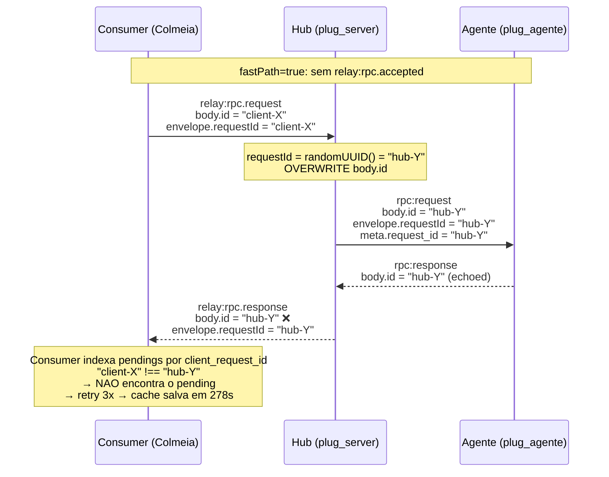
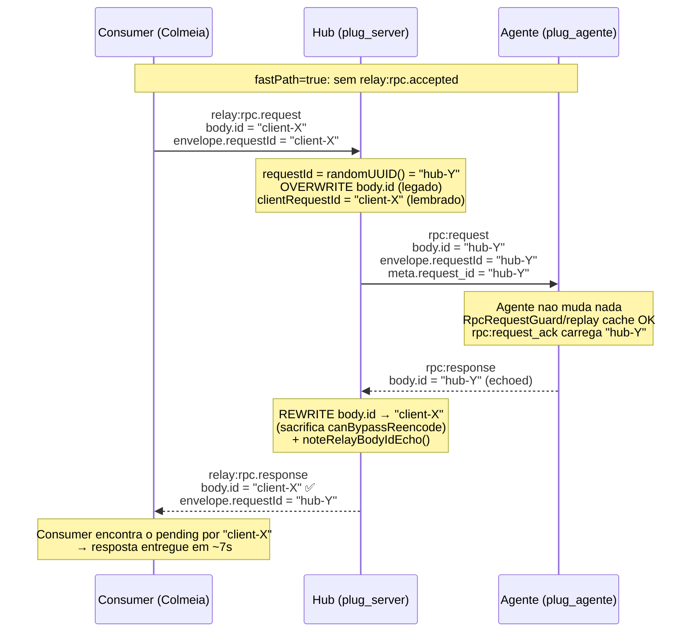
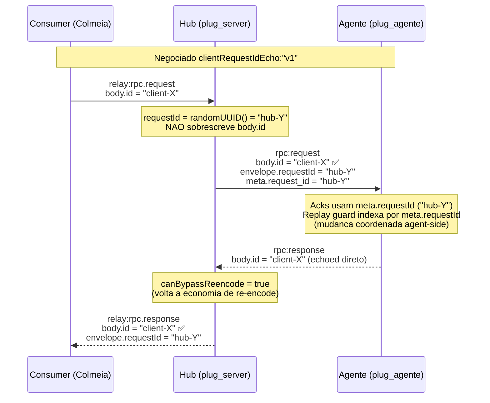

# Relay `body.id` echo — correcao do fast-path + evolucao opcional

> **TL;DR.** O hub estava sobrescrevendo `body.id` do JSON-RPC com o UUID
> interno (`requestId`) antes de despachar ao agente, o que quebrava o
> contrato JSON-RPC 2.0 §5 e impedia o consumer de rotear respostas no
> caminho `fastPath: true`. A correcao **default** (Opcao B) e feita
> 100% no hub na hora de encaminhar a resposta ao consumer — **o agente
> nao precisa mudar nada**. Esta pagina existe para deixar registrado:
>
> 1. **Por que nada muda no agente no release atual** (Opcao B).
> 2. **Quais ajustes serao necessarios se quisermos adotar a Opcao A**
>    no futuro (negociacao por extensao, ack passa a usar
>    `meta.requestId`, replay guard passa a indexar por `meta.requestId`).
>
> A Opcao A nao e prioritaria; e roadmap. Opcao B ja destrava o cliente
> Colmeia e quita a divida tecnica do contrato JSON-RPC 2.0 §5.

## Contexto

Hoje o hub gera um `requestId = randomUUID()` por dispatch relay e usa
esse valor em **dois** lugares ao encaminhar `rpc:request` para o agente:

1. **PayloadFrame envelope** (`envelope.requestId`): correlator wire-level.
2. **JSON-RPC `body.id`**: sobrescrevendo o `id` enviado pelo consumer.

### Fluxos antes e depois do fix (Opcao B)

**Antes (defeito):**



**Depois (Opcao B, shippada):**



**Roadmap (Opcao A, futuro):**



Codigo afetado no hub: [`rpc_bridge_dispatch_relay.ts`](../../src/presentation/socket/hub/relay/rpc_bridge_dispatch_relay.ts)
linhas 342-357.

```typescript
const requestId = randomUUID();
const commandPayload: Record<string, unknown> = {
  ...normalizedAndClamped,
  id: requestId,            // <- overwrite que quebrava o contrato
  api_version: ...,
  meta: { request_id: requestId, ... },
};
```

O agente, por contrato JSON-RPC 2.0 §5, **ecoa** `body.id` na resposta
(`request.id` em [`rpc_response_preparer.dart`](../../../plug_agente/lib/infrastructure/external_services/transport/rpc_response_preparer.dart)).
Resultado: a resposta volta ao hub com `body.id = hub_uuid`. No fluxo
**legado de 3 eventos**, o consumer recuperava o mapeamento
`client_request_id → hub_uuid` via `relay:rpc.accepted` e conseguia
rotear. No **fast-path** (`fastPath: true`), o `relay:rpc.accepted` nao
e emitido — o consumer ficava sem como rotear a resposta de volta ao
pending, retentava 3x e so sobrevivia via cache (`7 s → 278 s` no
`agent_sql_bridge_e2e_test.dart` do Colmeia).

## Opcao B — fix self-contained no hub (release atual)

### O que muda no fio

| direcao | hoje | depois de Opcao B |
| ------- | ---- | ----------------- |
| hub → agente (`rpc:request`) | `body.id = hub_uuid`, `meta.request_id = hub_uuid` | **mesma coisa** — sem mudanca |
| agente → hub (`rpc:response`) | `body.id = hub_uuid` (ecoado), `meta.requestId = hub_uuid` | **mesma coisa** — sem mudanca |
| hub → consumer (`relay:rpc.response`) | `envelope.requestId = hub_uuid`, `body.id = hub_uuid` | `envelope.requestId = hub_uuid`, **`body.id = client_request_id`** |
| agente → hub (`rpc:request_ack` / `rpc:batch_ack`) | `request_id = body.id = hub_uuid` | **mesma coisa** — sem mudanca |
| `RpcRequestGuard` (replay-detection no agente) | indexa por `body.id = hub_uuid` | **mesma coisa** — sem mudanca |

**O agente nao precisa de nenhum ajuste.** Toda a reescrita acontece no
hub apos receber a resposta do agente e antes de encaminhar ao consumer.

### Implicacoes no agente (informacionais)

Nada operacional, mas vale registrar para evitar confusao quando alguem
ler logs cross-repo:

- Logs do agente (SQL queue, RPC dispatcher) continuam mostrando o
  `request.id` (= `hub_uuid`). Nao mudou.
- O `meta.requestId` mirrored em `attachRequestTrace` continua sendo o
  mesmo valor que o `body.id`.
- Se voce esta tentando correlacionar um log do agente com um log do
  consumer, eles agora **diferem por design** — o consumer ve
  `client_request_id`, o agente ve `hub_uuid`. A ponte e o `requestId`
  no envelope do PayloadFrame, que e o `hub_uuid` (visivel em ambos os
  lados via `frame.requestId`).

## Opcao A — `body.id` end-to-end (roadmap opcional)

Esta opcao **nao** esta no release atual. Documentada aqui para registro
caso queiramos evoluir o contrato.

### Motivacao

- Hoje o hub paga uma operacao de JSON parse+stringify por resposta
  relay unary so para reescrever `body.id` (vide `rpc_bridge_agent_inbound.ts`
  `canBypassReencode`). E barato (~50-200 µs por resposta), mas e
  desnecessario se o agente ja receber e ecoar o `client_request_id`
  desde o inicio.
- Observabilidade: o `client_request_id` ficaria visivel nos logs do
  agente, simplificando debugging cross-repo end-to-end.

### Contrato proposto

1. **Negociar extensao no handshake.** Nova entrada em
   `agent:capabilities.extensions`:

   ```json
   {
     "extensions": {
       "clientRequestIdEcho": "v1"
     }
   }
   ```

   O hub so ativa o passthrough quando a extensao esta presente.
   Default: ausente (mantem comportamento atual).

2. **Quando a extensao esta negociada, o hub:**

   - **NAO sobrescreve** `body.id` no `commandPayload` enviado ao
     agente. Mantem `body.id` = `client_request_id`.
   - `meta.request_id` continua sendo o `hub_uuid` (correlator wire).
   - `envelope.requestId` continua sendo o `hub_uuid`.

3. **Quando a extensao esta negociada, o agente DEVE:**

   - Em [`_emitRequestAck`](../../../plug_agente/lib/infrastructure/external_services/transport/rpc_inbound_handler.dart)
     (linhas 446-453), passar a usar `meta.requestId` em vez de
     `request.id.toString()`:

     ```dart
     Future<void> _emitRequestAck(RpcRequest request) async {
       // Quando clientRequestIdEcho esta negociado, request.id pode ser
       // um id arbitrario do consumer; o id wire usado pelo hub para
       // correlacao e meta.requestId (hub UUID).
       final ackId = request.meta?.requestId ?? request.id?.toString();
       if (ackId == null) return;
       final ackPayload = {
         'request_id': ackId,
         'received_at': DateTime.now().toIso8601String(),
       };
       await _emitEvent('rpc:request_ack', ackPayload);
     }
     ```

   - Em [`_emitBatchRequestAck`](../../../plug_agente/lib/infrastructure/external_services/transport/rpc_batch_inbound_handler.dart)
     (linhas 572-581), simetrico — `request_ids` passa a vir de
     `meta.requestId` por item.

   - Em [`RpcRequestGuard.evaluate`](../../../plug_agente/lib/infrastructure/external_services/rpc_request_guard.dart)
     (linha 37): indexar replay cache por `meta.requestId` em vez de
     `body.id`, **somente** quando `clientRequestIdEcho` esta
     negociado. Sem essa mudanca, um consumer malformado que reusa
     `body.id` dentro de 2 minutos seria bloqueado por replay-detection
     no agente quando o **correto** seria deixar a dedup acontecer no
     hub via `relayIdempotencyTtlMs` (que ja e o caso hoje).

4. **Quando a extensao NAO esta negociada**, o hub mantem o
   comportamento atual (Opcao B) e o agente nao precisa fazer nada
   diferente do que faz hoje.

### Riscos a cobrir antes de ativar

- **Logs operacionais que filtram por UUID format.** Se algum log
  collector / SIEM extrai `request_id` esperando padrao UUIDv4, ele
  precisa tolerar strings arbitrarias (o consumer pode mandar qualquer
  string nao-vazia que passe pelo schema `rpc.request.schema.json`,
  cujo `id` aceita `["string","number","null"]`).
- **Compat backward.** A negociacao por extensao garante que agentes
  legados (que nao declaram `clientRequestIdEcho`) continuam vendo
  exatamente o que veem hoje. Rollout: opt-in agente-a-agente.
- **Risco de id-collision no replay guard.** Mitigado por (a) hub-side
  idempotency cache (5 min, default) cobrir a janela de 2 min do
  agent-side replay guard, (b) mudanca do guard para indexar por
  `meta.requestId` quando extensao esta negociada (ver item 3 acima).

### Quando trazer a Opcao A de volta

Recomenda-se reabrir esta proposta se uma das tres situacoes ocorrer:

1. CPU do hub mostrar gargalo dominante no caminho de re-encode de
   respostas relay (medir via `plug_socket_relay_bridge_encode_avg_ms`).
   Hoje o overhead e inferior a 5% do tempo total de RPC unary.
2. Necessidade de correlacionar logs end-to-end por `client_request_id`
   sem pagar lookup adicional no hub (debugging em campo).
3. Outro consumer alem do Colmeia passar a usar o relay e precisar do
   contrato JSON-RPC 2.0 §5 estrito no agent-side por requisito
   externo (ex: auditoria).

## Como validar o release atual (Opcao B)

Do lado do agente nao tem nada para validar — o agente continua
recebendo e respondendo exatamente como antes. A validacao e no hub:

```powershell
npm run test -- tests/unit/presentation/socket/hub/rpc_bridge_agent_inbound.test.ts
```

E no cliente Colmeia (referencia: `D:\Developer\Flutter\colmeia\docs\server_adjustments\relay_unary_fast_path.md`):

```powershell
flutter test test/integration/e2e/agent_sql_bridge_e2e_test.dart `
  --tags e2e --concurrency=1 `
  --dart-define=AGENT_BRIDGE_TRANSPORT=socket `
  --dart-define=E2E_DISABLE_RELAY_DISPATCH=false `
  --dart-define=SOCKET_RELAY_FAST_PATH_ENABLED=true
```

Resultado esperado: voltar para o baseline `~7 s` em vez dos `278 s`
medidos antes do fix.

## Referencias

- Codigo do hub afetado:
  - `src/presentation/socket/hub/relay/rpc_bridge_agent_inbound.ts`
    (rewrite de `body.id` antes de encaminhar a resposta ao consumer)
  - `src/presentation/socket/hub/relay/rpc_bridge_relay_stream.ts`
    (`emitRelayTimeoutResponse` — sintetizacao do timeout)
  - `src/shared/metrics/socket_consumer.metrics.ts`
    (`plug_socket_relay_body_id_echo_total`)
- Documentos canonicos atualizados:
  - `docs/socket_relay_protocol.md` ("Correlacao de IDs no relay")
- Pasta do cliente:
  `D:\Developer\Flutter\colmeia\docs\server_adjustments\relay_unary_fast_path.md`
