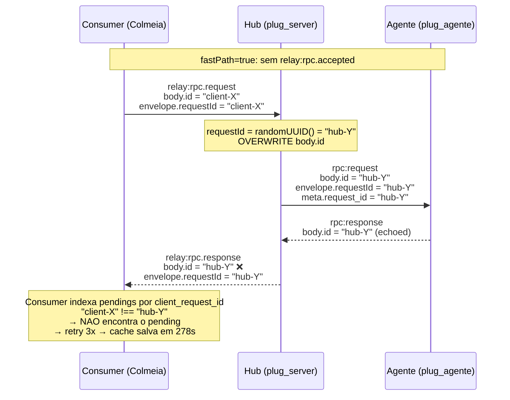
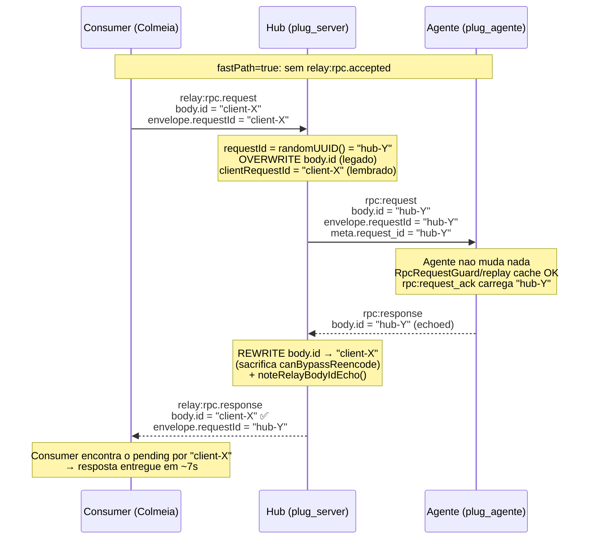
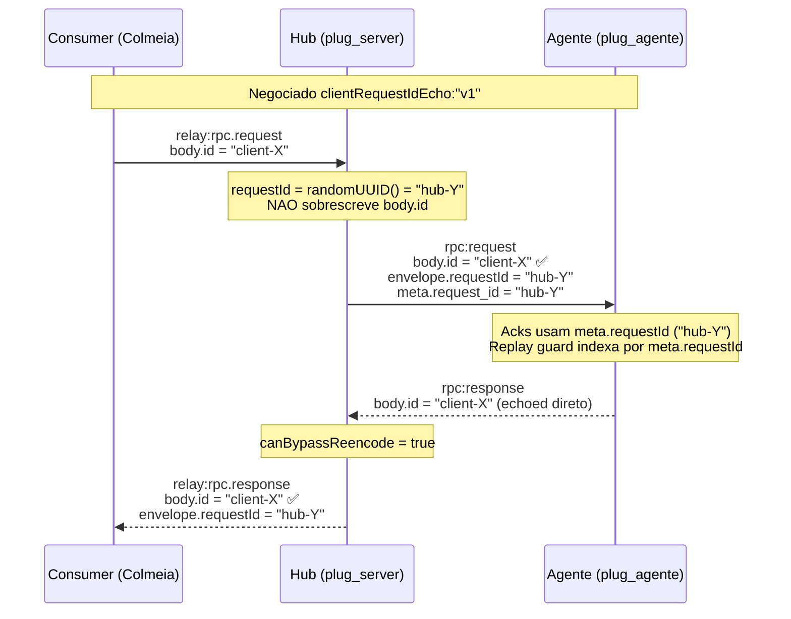

# Relay `body.id` echo — correcao do fast-path + Opcao A

> **TL;DR.** O hub sobrescrevia `body.id` do JSON-RPC com o UUID interno
> (`requestId`) antes de despachar ao agente, o que quebrava o contrato
> JSON-RPC 2.0 §5 e impedia o consumer de rotear respostas no caminho
> `fastPath: true`. Duas solucoes:
>
> 1. **Opcao B (default legado)** — rewrite no hub ao encaminhar a resposta
>    ao consumer; o agente nao muda nada.
> 2. **Opcao A (`clientRequestIdEcho: "v1"`) — shipped 2026-06-24** — quando
>    negociada, o hub preserva `body.id` end-to-end e salta o re-encode.
>    Decisao: [ADR 0009](../adrs/0009-client-request-id-echo.md). Contrato:
>    [`socket_relay_protocol.md`](../socket/socket_relay_protocol.md).
>
> Esta pagina e **historico do defeito + racional**. Para o contrato vivo,
> use o protocolo e o ADR.

## Contexto

O hub gera um `requestId = randomUUID()` por dispatch relay e usa esse
valor em **dois** lugares ao encaminhar `rpc:request` para o agente
(quando Opcao A nao esta negociada):

1. **PayloadFrame envelope** (`envelope.requestId`): correlator wire-level.
2. **JSON-RPC `body.id`**: sobrescrevendo o `id` enviado pelo consumer.

### Fluxos antes e depois do fix (Opcao B)

**Antes (defeito):**



**Depois (Opcao B, shippada):**



**Opcao A (shipped quando negociada):**



Codigo do overwrite legado: [`rpc_bridge_dispatch_relay.ts`](../../src/presentation/socket/hub/relay/rpc_bridge_dispatch_relay.ts).

O agente, por contrato JSON-RPC 2.0 §5, **ecoa** `body.id` na resposta.
No fluxo **legado de 3 eventos**, o consumer recuperava o mapeamento via
`relay:rpc.accepted`. No **fast-path**, sem `accepted`, o consumer ficava
sem como rotear — retentava 3x e so sobrevivia via cache (`7 s → 278 s`).

## Opcao B — fix self-contained no hub (fallback legado)

### O que muda no fio

| direcao | sem Opcao A | com Opcao B (rewrite) |
| ------- | ----------- | --------------------- |
| hub → agente (`rpc:request`) | `body.id = hub_uuid` | **mesma coisa** |
| agente → hub (`rpc:response`) | `body.id = hub_uuid` (ecoado) | **mesma coisa** |
| hub → consumer (`relay:rpc.response`) | `body.id = hub_uuid` | **`body.id = client_request_id`** |
| acks / replay guard no agente | indexam por `hub_uuid` | **mesma coisa** |

**Sem a extensao negociada, o agente nao precisa de ajuste** — a reescrita
acontece no hub.

### Implicacoes no agente (informacionais)

- Logs do agente continuam mostrando `request.id` (= `hub_uuid`) sob Opcao B.
- Para correlacionar consumer ↔ agente: ponte e o `requestId` no envelope
  PayloadFrame (`hub_uuid`), visivel em ambos os lados.

## Opcao A — `body.id` end-to-end (shipped)

> **Status:** **Accepted — v1 shipped** (2026-06-24). Hub
> [`560ef2f`](https://github.com/cesar-carlos/plug_server/commit/560ef2f) +
> agente [`741b5677`](https://github.com/cesar-carlos/plug_agente/commit/741b5677).
> Contrato normativo: [ADR 0009](../adrs/0009-client-request-id-echo.md) e
> [`socket_relay_protocol.md`](../socket/socket_relay_protocol.md).

### Motivacao (historico)

- Eliminar parse+stringify por resposta so para reescrever `body.id`.
- Observabilidade: `client_request_id` visivel nos logs do agente.

### Contrato (resumo)

1. Negociar `extensions.clientRequestIdEcho: "v1"` no handshake.
2. Hub **nao sobrescreve** `body.id`; `meta.request_id` e
   `envelope.requestId` continuam `hub_uuid`.
3. Agente: acks e replay guard usam `meta.requestId` (hub UUID).
4. Sem negociacao: comportamento Opcao B.

Detalhe completo, riscos e checklist: **ADR 0009**.

## Como validar

```powershell
npm run test -- tests/unit/presentation/socket/hub/rpc_bridge_agent_inbound.test.ts
```

E2E Colmeia (referencia no repo do cliente: `docs/server_adjustments/relay_unary_fast_path.md`):
baseline `~7 s` com `fastPath: true` no envelope de `relay:rpc.request`.
Kill switch de deploy no hub: `SOCKET_RELAY_FAST_PATH_FORBIDDEN=true` (nao existe
`SOCKET_RELAY_FAST_PATH_ENABLED`).

## Referencias

- Hub: `rpc_bridge_agent_inbound.ts`, `rpc_bridge_relay_stream.ts`,
  `plug_socket_relay_body_id_echo_total`
- Contrato: `docs/socket/socket_relay_protocol.md` ("Correlacao de IDs no relay")
- Decisao: [ADR 0009](../adrs/0009-client-request-id-echo.md)
