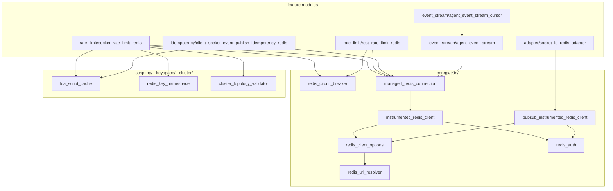
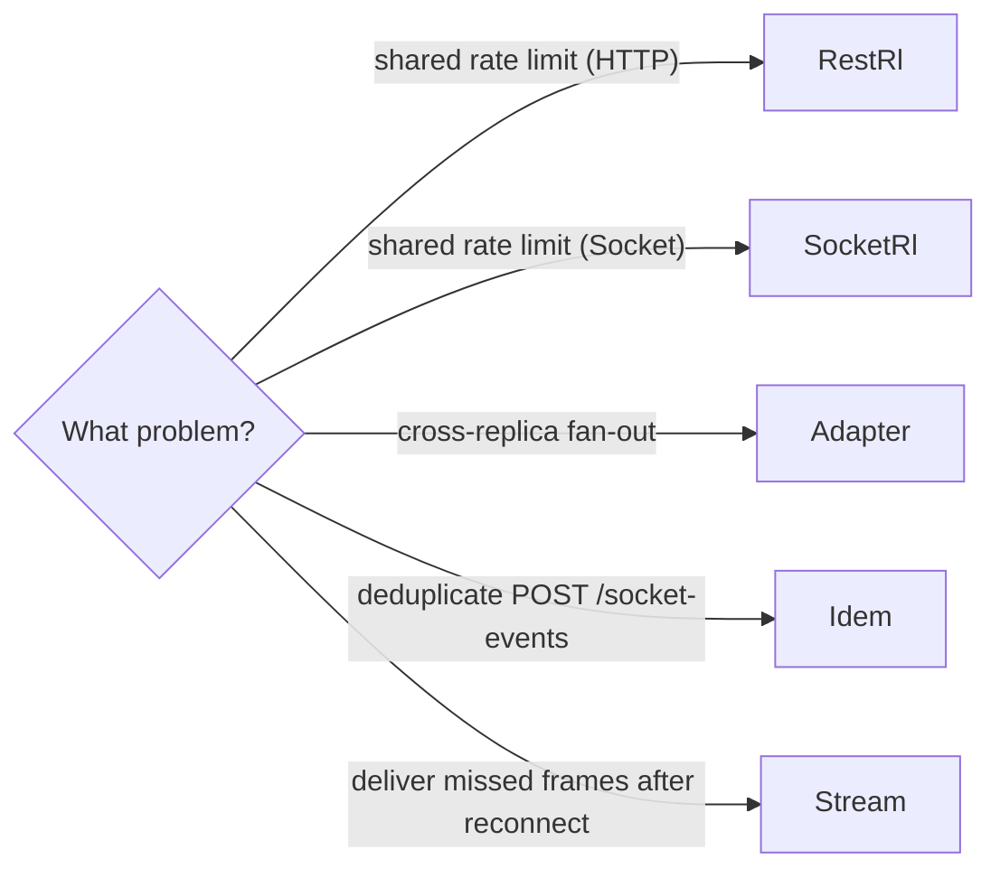

# `src/infrastructure/redis/` — module map

Redis-backed concerns are grouped into folders by responsibility. All
production modules are fail-open: if the URL is empty or the connection drops,
the hub continues running with degraded local-only behaviour and emits
`fallback` metrics.

## Directory layout

| Folder | Responsibility | Files |
| --- | --- | --- |
| `connection/` | Client creation, resilience and lifecycle | `instrumented_redis_client.ts`, `pubsub_instrumented_redis_client.ts`, `redis_client_options.ts`, `redis_url_resolver.ts`, `redis_auth.ts`, `redis_circuit_breaker.ts`, `managed_redis_connection.ts` |
| `scripting/` | Lua script preload + `EVALSHA`/`NOSCRIPT` fallback | `lua_script_cache.ts` |
| `keyspace/` | Key namespace (`{plug}` hash tag + tenant) and segment sanitization | `redis_key_namespace.ts` |
| `cluster/` | Best-effort Redis Cluster topology validation | `cluster_topology_validator.ts` |
| `rate_limit/` | Distributed rate-limit stores (socket + REST) | `socket_rate_limit_redis.ts`, `rest_rate_limit_redis.ts`, `socket_rate_limit_redis_sliding.ts` (experimental, not wired) |
| `event_stream/` | Per-recipient durable backlog stream + cursor | `agent_event_stream.ts`, `agent_event_stream_cursor.ts` |
| `idempotency/` | Distributed idempotency for `client:custom.*` publishes | `client_socket_event_publish_idempotency_redis.ts` |
| `adapter/` | Cross-replica Socket.IO pub/sub adapter | `socket_io_redis_adapter.ts` |
| `presence/` | Distributed agent presence + inter-replica bridge forward | `agent_hub_presence_redis.ts`, `agent_hub_presence_keys.ts` |



## Module purposes

| Module | Purpose | Public env |
| --- | --- | --- |
| [adapter/socket_io_redis_adapter.ts](adapter/socket_io_redis_adapter.ts) | Cross-replica pub/sub for Socket.IO rooms | `SOCKET_IO_REDIS_ADAPTER_URL` |
| [presence/agent_hub_presence_redis.ts](presence/agent_hub_presence_redis.ts) | Agent presence keys + `POST /agents/commands` forward between replicas | `AGENT_HUB_PRESENCE_REDIS_URL` (fallback: adapter URL) |
| [rate_limit/socket_rate_limit_redis.ts](rate_limit/socket_rate_limit_redis.ts) | Distributed socket-event rate limit (atomic consume-or-rollback Lua, circuit breaker) | `SOCKET_RATE_LIMIT_REDIS_URL` |
| [rate_limit/rest_rate_limit_redis.ts](rate_limit/rest_rate_limit_redis.ts) | `express-rate-limit` shared store with circuit breaker | `REST_RATE_LIMIT_REDIS_URL` |
| [idempotency/client_socket_event_publish_idempotency_redis.ts](idempotency/client_socket_event_publish_idempotency_redis.ts) | Distributed idempotency for `client:custom.*` (1-RTT `getEntry`, commit+release Lua, lock extend); read-replica via `_READ_URL` | `REST_SOCKET_EVENT_IDEMPOTENCY_REDIS_URL`, `REST_SOCKET_EVENT_IDEMPOTENCY_REDIS_READ_URL` |
| [event_stream/agent_event_stream.ts](event_stream/agent_event_stream.ts) | Per-recipient durable backlog stream — `appendAgentEventFramesBatch` pipelines `XADD` (+ optional `PEXPIRE`) into chunked `MULTI/EXEC`; `XREAD`/`XREADGROUP` + `XDEL`/`XACK` | `AGENT_EVENT_STREAM_REDIS_URL` |
| [event_stream/agent_event_stream_cursor.ts](event_stream/agent_event_stream_cursor.ts) | `lastSeenStreamId` cursor (`SET PX`) consumed by drain | (shares stream's URL) |

## Choosing the right module



- New rate-limit scope: extend `RestHttpRateLimitStoreScope` or
  `SocketRateLimitScope` and reuse the existing module — do not create a
  new Redis client.
- New durable per-recipient buffer needed: reuse `agent_event_stream` with
  an additional principal id namespace if needed; do not introduce a new
  module unless retention semantics differ materially.

## `connection/` — shared building blocks

- **`instrumented_redis_client.ts`** — single-client factory. Use for any
  module that does not need a paired pub+sub.
- **`pubsub_instrumented_redis_client.ts`** — exactly two clients (the
  `pub` and `pub.duplicate()` `sub` required by `@socket.io/redis-adapter`
  or any other library that needs a dedicated subscription connection).
- **`redis_client_options.ts`** — `buildResilientRedisClientOptions` is
  used by both factories (connect timeout + capped exponential reconnect),
  delegating URL parsing to `redis_url_resolver.ts`.
- **`redis_auth.ts`** — shared `isRedisAuthError`, `toSafeRedisErrorMessage`
  and `runRedisPostConnectAuthCheck` (post-connect `PING`, prod abort on
  `WRONGPASS`/`NOAUTH`).
- **`redis_circuit_breaker.ts`** — `createRedisCircuitBreaker` shared by the
  rate-limit modules (threshold/openMs via `REDIS_RATE_LIMIT_CIRCUIT_*`).
- **`managed_redis_connection.ts`** — `createManagedRedisConnection` owns the
  client slot, generation gating and URL-skip lifecycle so each module no
  longer hand-rolls that boilerplate. Hot paths read `getClient()`.

`scripting/lua_script_cache.ts` pre-loads scripts via `SCRIPT LOAD` and runs
them with `EVALSHA` + `NOSCRIPT` fallback (used by `rate_limit/` and
`idempotency/`).

## Operational guidance

- **Auth/TLS**: set `STRICT_REDIS_AUTH=true` in production to refuse boot
  on plain `redis://` URLs without password. See [docs/redis_security.md](../../../docs/redis_security.md)
  for the full checklist (auth, TLS, ACL examples, eviction policies, network
  isolation). For env contracts ("vazio = desligado", flag `_ENABLED`), see
  [docs/configuration.md](../../../docs/configuration.md).
- **Cluster ready**: all keys hash-tagged with `{plug}` (`{` and `}`
  surround the hash-tag content) via `keyspace/redis_key_namespace.ts`.
  Multi-key Lua scripts therefore land on the same slot in Redis Cluster.
  With `REDIS_TENANT_ID=<tenant>`, the hash tag becomes `{plug}:<tenant>` for
  hard tenant isolation — see [ADR-0006](../../../docs/adrs/0006-redis-multi-tenancy.md).
- **Parallel boot (Sprint P3.1)**: the four non-adapter modules init
  concurrently via `Promise.all` in `src/server.ts`. Total boot wait is
  `max(initᵢ)` instead of `Σ(initᵢ)`, which matters when one Redis URL is
  unreachable. Adapter init still serial because it depends on the `io`
  instance. See [ADR-0007](../../../docs/adrs/0007-parallel-redis-init.md).
- **Streams DB separation**: when `AGENT_EVENT_STREAM_ENABLED=true`,
  point `AGENT_EVENT_STREAM_REDIS_URL` to a logical DB different from the
  rate-limit/idempotency DB so a bursty stream cannot crowd out
  rate-limit state. Use `maxmemory-policy=noeviction` on the streams DB.
- **Pipelined fan-out (Sprint P1)**: multi-recipient publishes go through
  `appendAgentEventFramesBatch` — `XADD` (+ optional `PEXPIRE`) ship in
  chunked `MULTI/EXEC` (bounded chunk size) so neither the client queue nor
  the server reply array grows unbounded. `appendAgentEventFrame` is a
  one-entry wrapper kept for back-compat. See
  [docs/redis_streams_agent_backlog.md](../../../docs/redis_streams_agent_backlog.md).
- **Atomic consume-or-rollback (Sprint P2)**: the socket rate-limit
  consume Lua folds the over-limit `DECRBY` into the same script, reducing
  the deny path from 2 RTTs to 1.
- **1-RTT idempotency read/commit**: `getEntry` reads value+TTL in one Lua
  call; the successful publish path commits the entry and releases the lock
  in a single round-trip via `commitEntryAndReleaseLock`.
- **Observability**: each module exports a `*_redis_metrics.service.ts`
  with `redisStoreActive`, `circuitOpen`, `*_total` counters and a per-command
  latency histogram. See `docs/observability.md` and
  `docs/grafana/redis_dashboard.json` for default queries.
```

