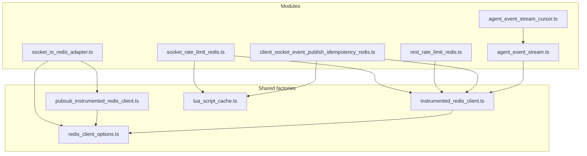
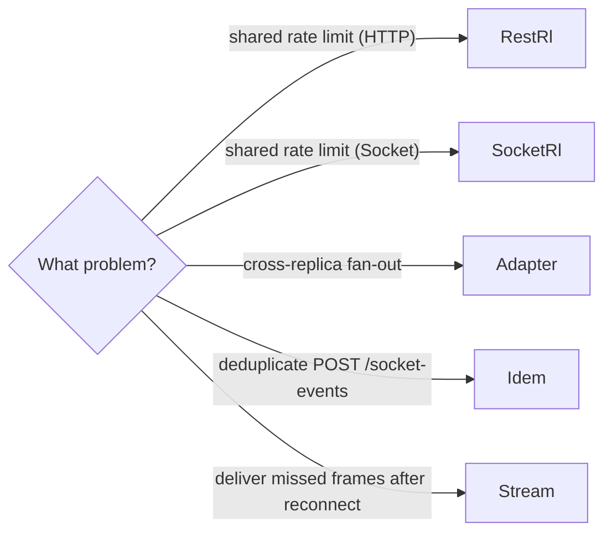

# `src/infrastructure/redis/` — module map

Five production modules and two factories share a Redis broker (or
brokers). All are fail-open: if the URL is empty or the connection drops,
the hub continues running with degraded local-only behaviour and emits
`fallback` metrics.

## Module purposes

| Module | Purpose | Public env |
| --- | --- | --- |
| [socket_io_redis_adapter.ts](socket_io_redis_adapter.ts) | Cross-replica pub/sub for Socket.IO rooms | `SOCKET_IO_REDIS_ADAPTER_URL` |
| [socket_rate_limit_redis.ts](socket_rate_limit_redis.ts) | Distributed socket-event rate limit (atomic consume-or-rollback Lua, circuit breaker) | `SOCKET_RATE_LIMIT_REDIS_URL` |
| [rest_rate_limit_redis.ts](rest_rate_limit_redis.ts) | `express-rate-limit` shared store with circuit breaker | `REST_RATE_LIMIT_REDIS_URL` |
| [client_socket_event_publish_idempotency_redis.ts](client_socket_event_publish_idempotency_redis.ts) | Distributed idempotency for `client:custom.*` (set + lock + extend Lua); read-replica via `_READ_URL` | `REST_SOCKET_EVENT_IDEMPOTENCY_REDIS_URL`, `REST_SOCKET_EVENT_IDEMPOTENCY_REDIS_READ_URL` |
| [agent_event_stream.ts](agent_event_stream.ts) | Per-recipient durable backlog stream — `appendAgentEventFramesBatch` pipelines all `XADD` (+ optional `PEXPIRE`) into one `MULTI/EXEC`; `XREAD`/`XREADGROUP` + `XDEL`/`XACK` | `AGENT_EVENT_STREAM_REDIS_URL` |
| [agent_event_stream_cursor.ts](agent_event_stream_cursor.ts) | `lastSeenStreamId` cursor (`SET PX`) consumed by drain | (shares stream's URL) |

## Choosing the right module

- New rate-limit scope: extend `RestHttpRateLimitStoreScope` or
  `SocketRateLimitScope` and reuse the existing module — do not create a
  new Redis client.
- New durable per-recipient buffer needed: reuse `agent_event_stream` with
  an additional principal id namespace if needed; do not introduce a new
  module unless retention semantics differ materially.

## Factories — when to use which

- **`instrumented_redis_client.ts`** — single-client modules. Use for any
  module that does not need a paired pub+sub.
- **`pubsub_instrumented_redis_client.ts`** — exactly two clients (the
  `pub` and `pub.duplicate()` `sub` required by `@socket.io/redis-adapter`
  or any other library that needs a dedicated subscription connection).
- **`redis_client_options.ts`** — `buildResilientRedisClientOptions` is
  used by both factories. Set `connectTimeoutMs`/`reconnectBaseMs`/
  `reconnectMaxMs` overrides only when a module needs different behaviour
  from the global defaults (`REDIS_DEFAULT_*` envs).
- **`lua_script_cache.ts`** — pre-loads scripts via `SCRIPT LOAD` and runs
  them with `EVALSHA` + `NOSCRIPT` fallback. Initialise per module that
  uses Lua scripts (currently `socket_rate_limit_redis` and
  `client_socket_event_publish_idempotency_redis`).

## Operational guidance

- **Auth/TLS**: set `STRICT_REDIS_AUTH=true` in production to refuse boot
  on plain `redis://` URLs without password. See [docs/redis_security.md](../../../docs/redis_security.md)
  for the full checklist (auth, TLS, ACL examples, eviction policies, network
  isolation). For env contracts ("vazio = desligado", flag `_ENABLED`), see
  [docs/configuration.md](../../../docs/configuration.md).
- **Cluster ready**: all keys hash-tagged with `{plug}` (`{` and `}`
  surround the hash-tag content). Multi-key Lua scripts therefore land on
  the same slot in Redis Cluster. With `REDIS_TENANT_ID=<tenant>`, the
  hash tag becomes `{plug}:<tenant>` for hard tenant isolation — see
  [ADR-0006](../../../docs/adrs/0006-redis-multi-tenancy.md).
- **Parallel boot (Sprint P3.1)**: the four non-adapter modules init
  concurrently via `Promise.all` in `src/server.ts`. Total boot wait is
  `max(initᵢ)` instead of `Σ(initᵢ)`, which matters when one Redis URL is
  unreachable. Adapter init still serial because it depends on the `io`
  instance. See [ADR-0007](../../../docs/adrs/0007-parallel-redis-init.md).
- **Streams DB separation**: when `AGENT_EVENT_STREAM_ENABLED=true`,
  point `AGENT_EVENT_STREAM_REDIS_URL` to a logical DB different from the
  rate-limit/idempotency DB so a bursty stream cannot crowd out
  rate-limit state. Use `maxmemory-policy=noeviction` on the streams DB.
- **Pipelined fan-out (Sprint P1)**: multi-recipient publishes go through
  `appendAgentEventFramesBatch` — every `XADD` (and optional `PEXPIRE`)
  ships in a single `MULTI/EXEC` for one cluster RTT regardless of the
  recipient count. `appendAgentEventFrame` is a one-entry wrapper kept
  for back-compat. See
  [docs/redis_streams_agent_backlog.md](../../../docs/redis_streams_agent_backlog.md)
  ("Batch fan-out").
- **Atomic consume-or-rollback (Sprint P2)**: the socket rate-limit
  consume Lua now folds the over-limit `DECRBY` into the same script,
  reducing the deny path from 2 RTTs to 1. The legacy `consume` and
  `refund` scripts stay loaded for the external refund path
  (`refundSocketRateLimitRedis`).
- **Observability**: each module exports a `*_redis_metrics.service.ts`
  with `redisStoreActive`, `circuitOpen`, `*_total` counters, per-command
  latency histogram (binary-search bucket lookup since Sprint P4), and
  the new performance counters
  (`plug_socket_rate_limit_consume_atomic_rollbacks_total`,
  `plug_agent_event_stream_batch_appends_total`,
  `plug_agent_event_stream_batch_partial_failures_total`,
  `plug_agent_event_stream_batch_size_bucket{le}`,
  `plug_socket_custom_event_publish_fetch_sockets_dedupes_total`).
  See `docs/observability.md` and `docs/grafana/redis_dashboard.json`
  for default queries.
